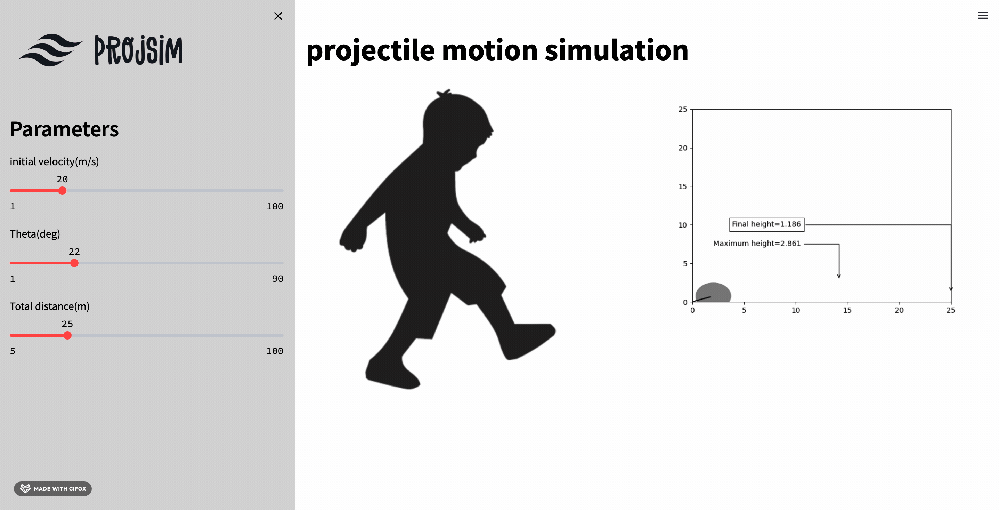

# (PROJSIM) projectile motion simulation
A simulation program with a graphical user interface displaying the following parameters:
inputs:

• Distance from the goal

• Firing angle

• Firing velocity 

Indicators:

• Maximum ball height

• Ball height at the goal plane arrival point


## Installation

Use the package manager [pip](https://pip.pypa.io/en/stable/) to install modules.

```bash
pip install numpy
```
```bash
pip install matplotlib
```
```bash
pip install animation
```
```bash
pip install streamlit
```

## To start deployment

```bash
streamlit run app.py
```

## Demo



All rights reserved © 2023 - Systems & Biomedical Engineering, Cairo University (Class 2024)
